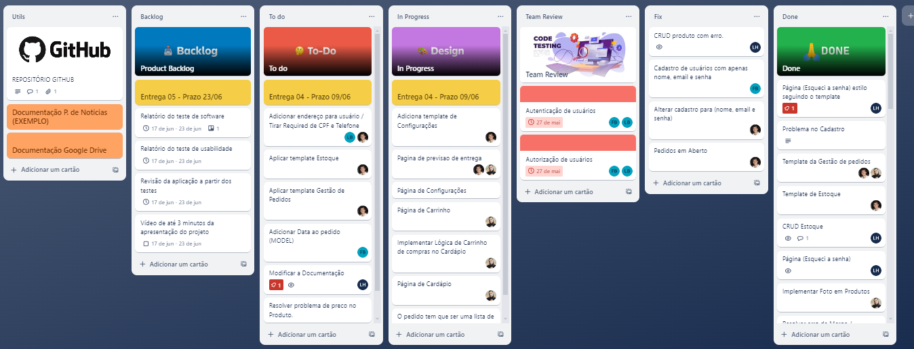

# Metodologia

Esta seção descreve a organização da equipe para a execução das tarefas do projeto e as ferramentas utilizadas para a manutenção dos códigos e demais artefatos.

## Relação de Ambientes de Trabalho

Os artefatos do projeto são desenvolvidos a partir de diversas plataformas e a relação dos ambientes com seu respectivo propósito é apresentada na tabela que se segue. 

|      AMBIENTE               |  PLATAFORMA  |LINK DE ACESSO         |
|-----------------------------|--------------|----------------------------------------|
| Ferramentas de comunicação  | WhatsApp + Microsoft Teams + Discord | -
| Repositório de código-fonte | GitHub                               | [Github](https://github.com/ICEI-PUC-Minas-PMV-ADS/pmv-ads-2024-1-e2-proj-int-t3-grupo-05)|
| Gerenciamento do projeto    | Trello                               | [Trello](https://trello.com/b/sq4C8zR3/projeto-eixo-2-grupo-05)|

## Gestão de código fonte

Para gestão do código fonte do software desenvolvido pela equipe, o grupo utiliza um processo baseado no Git Flow abordado por Vietro (2015), mostrado na Figura a seguir. Desta forma, todas as manutenções no código são realizadas em branches separados, identificados como Hotfix, Release, Develop e Feature. Uma explicação rápida sobre este processo é apresentada no artigo ".[Git Workflow: o que é e principais tipos](https://www.zup.com.br/blog/git-workflow)".

## Gerenciamento do Projeto
A equipe utiliza metodologias ágeis, tendo escolhido o Scrum como base para definição do processo de desenvolvimento.
A equipe está organizada da seguinte maneira:

- `Scrum Master` [Guilherme Patrick](https://github.com/guilhermepatrick)
- `Product Owner` [Fabiana Britto](https://github.com/FabianaBritto)
- `Equipe de Desenvolvimento` [Fabiana Britto](https://github.com/FabianaBritto), [Guilherme Patrick](https://github.com/guilhermepatrick), [Leandro Borth](https://github.com/leandroborth), [Lucas Xavier](https://github.com/xavierlbx), [Luiz Hovadich](https://github.com/luiz-hovadich), [Marina Mariano](https://github.com/marinadionysio1)
- `Equipe de Design` [Luiz Hovadich](https://github.com/luiz-hovadich)

## Organização

Para organização e distribuição das tarefas do projeto, a equipe está utilizando o Trello estruturado com as seguintes listas: 

- `Utils` Esta lista mantém template de tarefas recorrentes com as configurações padronizadas que todos devem seguir. O objetivo é permitir a cópia destes templates para agilizar a criação de novos cartões.
- `Product Backlog` Recebe as tarefas a serem trabalhadas e representa o Product Backlog. Todas as atividades identificadas no decorrer do projeto também devem ser incorporadas a esta lista.
- `To Do` Esta lista representa o Sprint Backlog. Este é o Sprint atual que estamos trabalhando.
- `In Progress` Quando uma tarefa tiver sido iniciada, ela é movida para cá.
- `Team Review` Checagem de Qualidade. Quando as tarefas são concluídas, eles são movidos para o “CQ”. No final da semana, eu revejo essa lista para garantir que tudo saiu perfeito.
- `Done` Nesta lista são colocadas as tarefas que passaram pelos testes e controle de qualidade e estão prontos para ser entregues ao usuário. Não há mais edições ou revisões necessárias, ele está agendado e pronto para a ação.

[Quadro Kanban](https://trello.com/b/sq4C8zR3/projeto-eixo-2-grupo-05)
