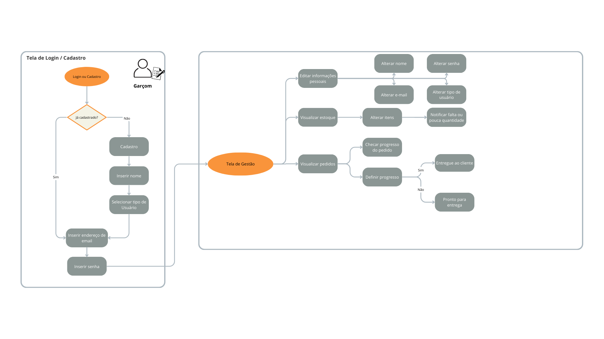

# Projeto de Interface

Visão geral da interação do usuário pelas telas do sistema e protótipo interativo das telas com as funcionalidades que fazem parte do sistema (wireframes).

## Diagrama de Fluxo

O diagrama apresenta o estudo do fluxo de interação do usuário com o sistema interativo e  muitas vezes sem a necessidade do desenho do design das telas da interface. Isso permite que o design das interações seja bem planejado e gere impacto na qualidade no design do wireframe interativo que será desenvolvido logo em seguida.

### Fluxograma - Proprietário

### Fluxograma - Cozinheiro

### Fluxograma - Garçom

### Fluxograma - Cliente

## Wireframes
<a target="blank" href="https://www.figma.com/proto/rn6FjloWva0vQeF9NYtHPb/Figma---Cliente?page-id=0%3A1&type=design&node-id=8-17&viewport=354%2C240%2C0.67&t=XEwIykoQU3wdcskJ-1&scaling=scale-down&starting-point-node-id=8%3A17&mode=design">Acesse nosso Wireframe Interativo</a>

